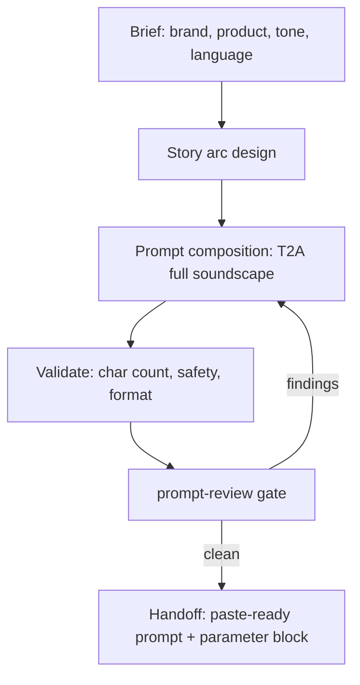

# Seed Audio Commercial

Compose dramatic, story-driven audio commercial prompts for BytePlus Seed Audio
1.0 (`seed-audio-1.0`). This skill writes full-soundscape T2A (text-to-audio)
prompts that produce dialogue, background music, sound effects, and ambience in
a single generation pass — no separate mixing, scoring, or Foley required.

**Pairs with `seed-audio-prompt`** for Seed Audio prompt structure, voice
profile formatting, timestamp control, and limits. This skill specializes the
commercial workflow: story arc design, commercial-specific SFX and music
patterns, and multilingual safety-filter guidance.

**Prompt-composition only.** The deliverable is the paste-ready prompt and its
parameter block; the user generates in the destination UI. This skill never
calls tools and never runs a generation.

## Input and output contract

Input: brand, audience, language, cast, story objective, and target duration.

Output: a commercial soundscape prompt with its parameter block, delivered
paste-ready in chat (saved under `projects/<project>/prompts/` only on
request), after `prompt-review`.

## Procedure and reference loading

The workflow below is the entry path. Add commercial-sound-patterns to design
music/SFX and worked-examples for a relevant commercial pattern; examples do
not change the requested language.

Read only the mode-specific resources needed for the request. Reference paths
mentioned in prose are relative to this skill directory unless a link says
otherwise.

- [Commercial Sound Patterns](references/commercial-sound-patterns.md) — Commercial music direction patterns; SFX patterns for food commercials; Ambience transition patterns; Story arc template (5 acts).
- [Worked Examples](references/worked-examples.md) — Full example: Jollibee Chickenjoy (Taglish); Full example: Lola Maria's Ube Halaya (Taglish, 30s spot).

## Submission boundary and failure behavior

The caller owns the handoff: freeze the reviewed prompt, deliver it with its
ordered parameter block, and let the user paste it into the destination UI. A
leaf returns its prompt package without loading sibling skills. Missing
required inputs remain unresolved; a delivered prompt is not an approved
generation. Provider-side outcomes the user reports back are diagnostic
evidence for revision — rejection is evidence to diagnose, not a false
positive by default, and reported success is review, never approval.

## What this skill produces

A paste-ready commercial soundscape prompt with:

- Full soundscape in one pass (dialogue + BGM + SFX + ambience)
- Multi-character voice profiles with distinct ages, accents, and emotions
- Dramatic story arc (setup → conflict → resolution → brand tagline)
- Music that shifts with the emotional beats of the story
- Chronologically interleaved SFX and ambience transitions
- The parameter block (format, sample rate, subtitle options) beside the prompt

## When to use this skill

- "Create an audio commercial for [brand/product]"
- "Make a dramatic radio spot for [product]"
- "Write a story-based audio ad with dialogue and music"
- "Produce a Filipino/Taglish commercial using Seed Audio"
- "Write a multi-character narrative audio spot"
- "Make a brand commercial with emotional arc and tagline"

## When NOT to use

- **Plain TTS or single-voice narration** — use `seed-audio-prompt` directly
  without the commercial story structure.
- **Video generation** — use Seedance skills (`seedance-prompt-25` for 2.5,
  `seedance-prompt-20` for 2.0). If the dialogue track is for a Seedance video
  and the user has explicitly requested lip-synced audio, write the audio
  prompt first, keep `duration ≤ video_duration`, and have the user supply the
  generated audio as the `reference_audio` binding. When the user has not
  requested lip-synced audio, write the video prompt directly and let
  Seedance's native audio handle dialogue.
- **Image generation** — use Seedream skills (`seedream-prompt`).
- **Voice cloning for consistent characters across multiple clips** — use
  `seed-audio-prompt` in TA2A mode with reference audio clips.

## Workflow



### Step 1 — Gather the brief

Collect or propose:

| Field | Example | Required |
|---|---|---|
| Brand | Jollibee | Yes |
| Product | Chickenjoy (crispy fried chicken) | Yes |
| Tone | dramatic, emotional, nostalgic | Yes |
| Language | English, Taglish, Spanish, etc. | Yes |
| Target duration | ~60–120s (max 120s per prompt) | Yes |
| Cast | 2–4 characters with voice profiles | Yes |
| Story hook | homesick worker, family reunion, etc. | Yes |
| Tagline / CTA | "Home is just one bite away" | Yes |
| Cultural context | Filipino OFW experience, etc. | If relevant |

### Step 2 — Design the story arc

A dramatic commercial needs a **five-act micro-story**:


| Act | Purpose | Audio character |
|---|---|---|
| **1 — Setup** | Establish the emotional state and environment | Melancholic / tense music, sparse ambience |
| **2 — Conflict** | Introduce the tension or longing | Music intensifies or shifts, dialogue escalates |
| **3 — Journey** | Character moves toward the product | Ambience transitions, footsteps, door sounds |
| **4 — Turn / Reveal** | The product triggers an emotional shift | Music transforms (sad → warm), SFX (crunch, pour, sizzle) |
| **5 — Resolution + Tagline** | Emotional resolution, brand voiceover | Bright/uplifting music, announcer delivers CTA |

**Rules:**
- Each act must have a **distinct audio state** (music mood, ambience, intensity).
- Transitions between acts must be tied to **observable events** (a door opening,
  a bite, a phone ring), not arbitrary cuts.
- The product must be the **trigger for the emotional turn** in Act 4.
- The tagline in Act 5 must connect the emotional story to the brand promise.

### Step 3 — Compose the T2A prompt

Assemble the prompt using the full-soundscape order shown in the template below
(scene and atmosphere, characters and dialogue, ending), arranged as one
chronological audio scene. Use this commercial template:

```text
Scene and atmosphere
Environment: [location, time, weather, acoustic space, emotional tone]
Background music: [dramatic role, genre, instruments, tempo, mood, dynamic arc
  tied to story beats, mix relationship to dialogue, ending behavior]
Ambience: [foreground, midground, background layers and how they evolve]

Characters and dialogue
[SFX or ambience that opens the scene]

[Character A] ([age, gender, accent, voice timbre, emotional baseline, delivery
  style]) says [delivery note]: "[dialogue]"

[Music/SFX/ambience change triggered by the line or action.]

[Character B] ([contrasting voice profile]) replies [delivery]: "[dialogue]"

[Continue interleaving dialogue, actions, SFX, and score changes in
chronological order through all five acts.]

[Character A] (internal voice-over, [delivery]) says, voice [emotion]:
  "[emotional peak dialogue]"

[The brand tagline from the announcer.]

Announcer ([deep/warm/confident, gender, broadcaster tone]) says with [tone]:
  "[Brand]. [Product qualities]. [Tagline / CTA]."

[The brand jingle plays its final bright notes and resolves cleanly.]

Ending
[Describe the final sound: music resolution, ambience tail, fade to silence.]
```

### Step 4 — Validate before handoff

Check these constraints before delivering the prompt:

| Check | Limit | Action if exceeded |
|---|---|---|
| Prompt length | 3,000 characters | Trim redundant descriptions, shorten stage directions |
| Target duration | 120 seconds max per generation | Split into multiple prompts and chain via TA2A |
| Output format | MP3 at 24000 Hz recommended | WAV at 44100 Hz can exceed artifact size limits in some destinations |
| Non-English dialogue | Content safety filter may reject | See [Multilingual and Taglish guidance](#multilingual-and-taglish-guidance) |
| Reference audio | Not needed for T2A | Omit audio references and all `<<TGT_SPKN>>` tags |

**Format recommendation**: put `mp3` at `24000` Hz in the parameter block for
commercials; it keeps file sizes small for the destination workflow.

### Step 5 — Review and handoff

Run `prompt-review` on the exact prompt and parameter block; resolve
CRITICAL/MAJOR findings and re-review changed prompts. Then deliver the
paste-ready block in chat: the prompt, the parameter block (format, sample
rate, subtitle options), and the story-arc summary (one line per act). Save a
draft under `projects/<project>/prompts/` only on explicit request.

## Multilingual and Taglish guidance

Seed Audio supports multilingual synthesis. A moderation error is a provider
rejection, not proof that a language, phrase, or cultural term is unsafe or that
the classifier made a false positive. Record the reported code and reason the
user relays, without inventing a cause.

Review the actual content and rights context. Correct a legitimate issue with a
recorded change contract, or use the destination's support/appeal path when the
reason is unclear. Preserve the user's requested language unless a translation
is explicitly requested or agreed. Rephrasing to disguise content or bypass a
filter is not a remediation strategy. A revised prompt gets a fresh
prompt-review pass; no wording promises a guaranteed pass.
