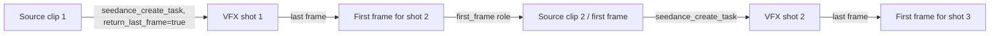

# Fidelity And Continuity

Focused reference for `seedance-vfx-prompt`. Read [the entrypoint](../SKILL.md) for
mode selection and caller responsibilities.

- [Resolution: model and operation first](#resolution-model-and-operation-first)
- [Photoreal creature / element integration](#photoreal-creature--element-integration)
- [Duration discipline](#duration-discipline)
- [Integrating with project elements](#integrating-with-project-elements)
- [Chaining VFX shots](#chaining-vfx-shots)

## Resolution: model and operation first

| Selected path | Resolution decision | Review focus |
|---|---|---|
| Seedance 2.5 edit | Supported 480p/720p/1080p according to live tool evidence | Skin, facial motion, edges, texture, and lip-sync where applicable |
| Explicitly requested supported 2.0 4K path | 4K only after model/operation capability and cost are resolved | Same face/detail QA; 4K does not guarantee preservation |
| Prototype on either path | Lowest suitable supported resolution | Validate requested change and source locks before increasing cost |

Do not switch from 2.5 to 2.0 solely because a face is visible. Record requested
resolution separately from actual output properties. Check operation-specific
limits rather than copying a general generation duration into an edit request.

## Photoreal creature / element integration

When a creature or hard-surface element is added and must read as real:

- Demand wildlife-documentary or practical realism explicitly: "fully
  photoreal, real fur with depth and individual strands (or true-scale detail /
  brushed metal), true anatomy, **never CG, plastic, or cartoonish**."
- Tie it into the plate: same sun direction and color temperature as the
  subject, real soft-edged contact shadow on what it touches, same hazy
  atmosphere and depth as the far background.
- **Scale must be explicit** for giant creatures, or the model renders them
  life-size. Say "enormous, its massive body dwarfing the structure, clearly
  colossal relative to the mast."
- If it still reads as CG after a take, the reliable fix is a **second input**
  — a reference photo of the real animal or material — declared as a
  texture-only `@Image N` reference in `Asset preparation:`:

  ```text
  Asset preparation:
  @Video 1: source clip — [subject, action, camera]. Preserve identity,
  performance, framing, camera exactly; [what to change].
  @Image 1: texture reference — reference photo of a real <animal>. Appearance
  and fur/skin texture reference only; ignore the photo's background and lighting,
  do not use it for the environment.
  ```

  Then rewrite the prompt to point the creature at the `@Image 1` reference.
- **Behavior must match the species:** a sloth shifts slow heavy weight; a chimp
  is alert and twitchy; a snake's coils tighten and a forked tongue tastes the
  air (and snakes don't blink — use an unblinking stare, not a blink, for a
  reptile payoff).
- The subject usually stays **oblivious / unfazed**, mid-delivery — that
  contrast is the joke. State it.
- When a long hold lands on a static creature, add small **"living"
  micro-movements** (a slow blink, jaw shift, steady breath) so it doesn't
  look frozen.

## Duration discipline

Default to the source clip's exact runtime. When the user changes the runtime,
**recompute** any numeric zoom timing and tell them the new mark. When a long
hold lands on a static creature, add small "living" micro-movements (a slow
blink, jaw shift, steady breath) so it doesn't look frozen.

### Prepended-intro budget: intro + remaining = total

When you prepend a beat (a reveal, a telephoto hold, an establishing creature
shot) to footage you must preserve, the preserved take does not get longer — it
gets *pushed back*. State the arithmetic every time and flag what falls off:

`total runtime − intro length = surviving window for the source performance`

If the source take is longer than that surviving window, some of it cannot
play. Say so explicitly and offer the three resolutions, in order of fidelity:

1. **Extend the total** so the full source fits (intro + full source). Highest
   fidelity, longest clip.
2. **Start the source earlier** — sacrifice the clip's own quiet lead-in so the
   dialogue still lands in the window. Keeps total fixed, keeps the words,
   loses pre-roll.
3. **Accept truncation** — the first N seconds of the source won't appear. Only
   safe if the dropped head has no dialogue.

Never promise "100% lip-sync" and a prepended intro on a fixed total without
doing this subtraction first. Recompute and re-flag it on *every* change to
either number.

## Integrating with project elements

When a VFX prompt references a reusable element from the project (a character, a
creature, a prop, a location), use the `@tag` reference convention from the
workspace's `elements/` directory alongside the `@Image N` / `@Video N` index
convention.

```text
Asset preparation:
@Video 1: source clip — a woman walks through a park, static medium shot, 5 seconds.
@Image 1: location sheet — @neon-alley reference.
@Image 2: prop sheet — @red-motorcycle reference.

Subject definitions:
Define the woman with the ponytail and green jacket in @Video 1 as Woman

Prompt:
Task type: Video Editing
Strictly edit @Video 1, and modify the park to the @neon-alley location from @Image 1 at 0:00. The @red-motorcycle prop from @Image 2 should be parked to the left of frame. Unmentioned parts stay unchanged.

Locks: Woman@Video 1's face, body, clothing, and walking cadence locked exactly.
Static camera framing locked frame-for-frame.

New world: @neon-alley as defined in @Image 1: a narrow neon-lit alley behind a
24-hour noodle bar, wet asphalt reflecting pink and blue signs, steam from a
noodle cart. @red-motorcycle from @Image 2 parked to the left, its red fuel tank
catching the neon reflections.
```

The `@tag` convention (e.g. `@neon-alley`, `@red-motorcycle`, `@gloria`)
ensures the model treats these as established identities rather than freeform
descriptions. The reference images from `elements/<id>/references/` should be
attached to the Seedance task as `reference_image` entries alongside the source
video.

## Chaining VFX shots

For multi-shot VFX sequences, use Seedance's `return_last_frame` parameter on
each task. The returned last frame becomes the `first_frame` image for the next
shot, ensuring visual continuity across cuts.



In the prompt for chained shots, the `@Video 1` description should note the
inherited first frame:

```text
Asset preparation:
@Video 1: continuation shot — first frame inherited from the last frame of the
prior shot (Woman standing in @neon-alley). She turns and walks toward camera,
5 seconds.
```

> **Seedance 2.5 alternative**: For pure extension tasks (no VFX change, just
> extending a clip), Seedance 2.5's native forward/backward extension can replace
> the manual `return_last_frame` chaining above. Use `seedance-prompt-25` with
> the 2.5 model (`dreamina-seedance-2-5-260628`) and `seedance_2_5_create_task`.
