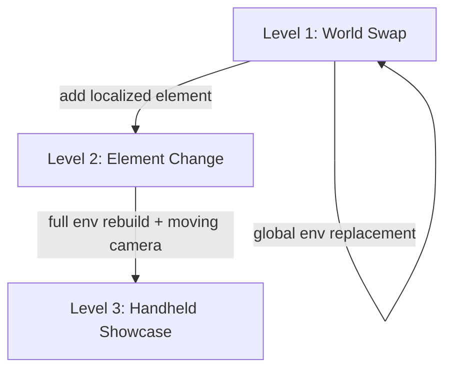

# Legacy Vfx Levels

Focused reference for `seedance-vfx-prompt`. Read [the entrypoint](../SKILL.md) for
mode selection and caller responsibilities.

- [The three VFX levels](#the-three-vfx-levels)

## The three VFX levels

Adapt the prompt structure to the complexity of the effect. Each level adds
complexity — start at Level 1 and escalate only when the effect demands it.



### Level 1 — World Swap

**Replace the entire background/environment while preserving the subject and
camera motion.** This is the most common VFX edit.

The change happens at `0:00` and is global. The subject's identity,
performance, and camera motion are fully locked.

```text
Asset preparation:
@Video 1: source clip — a woman in a red coat stands on a train platform, static camera, she looks left then right, 5 seconds.

Subject definitions:
Define the woman with the red coat and shoulder-length dark hair in @Video 1 as Woman

Prompt:
Task type: Video Editing
Strictly edit @Video 1, and modify the train platform to an abandoned subway station flooded with knee-deep water at 0:00. Woman@Video 1 stands on a raised section of platform above the water line. Unmentioned parts stay unchanged.

Locks: Woman@Video 1's face, red coat, hair, and body locked exactly. Head-turn
timing and the static camera framing locked frame-for-frame.

New world: An abandoned subway station, tiled walls cracked and covered in moss,
water reflecting dim emergency lighting, old turnstiles half-submerged in the
foreground, a collapsed ceiling letting in a shaft of pale daylight from above.

Lighting: A single emergency light on the far wall casts a flickering amber glow
across the water surface. The daylight shaft from the collapsed ceiling provides
a cool white key light on Woman@Video 1 from above-left. The water reflects and
scatters the amber light across the lower walls.

Space: Foreground — submerged turnstile, rippling water surface close to camera.
Midground — Woman@Video 1 on the raised platform, the tiled wall behind her.
Background — dark tunnel mouth receding into black, faint amber reflection on
the water fading to darkness.

Audio: Water dripping echoing in the large space, a low electrical hum from the
emergency light, distant rumble from somewhere deep in the tunnel. Woman@Video 1's
breath and the faint rustle of her coat preserved from source. SFX and source
dialogue only.

Quality and constraints:
Quality: photoreal, 4K, cinematic texture, natural colors.
Constraints: NON-IP — no recognizable real persons, no copyrighted characters.
Face protection — real human skin with pores and catchlights, never waxy or
warped. Lip and jaw sync must match source frame-for-frame.
```

### Level 2 — Element Change

**Add or modify one element in-frame without changing the rest of the
environment.** The change is localized in both space and time.

Use sequential staging: introduce the element at a specific timestamp, let it
develop, and resolve it before the end of the clip.

```text
Asset preparation:
@Video 1: source clip — a man sits at a wooden desk writing in a notebook, static medium shot, warm lamp light, 5 seconds.

Subject definitions:
Define the man with short hair and a grey sweater in @Video 1 as Man

Prompt:
Task type: Video Editing
Strictly edit @Video 1. At 0:01, add small glowing runes that begin appearing on the notebook page under Man@Video 1's pen as he writes. The runes spread gradually across the page. The man does not notice them. The desk and room do not change.

Locks: Man@Video 1's face, hands, desk, notebook, pen, and the lamp light
locked exactly. Static camera framing and the man's writing motion locked
frame-for-frame.

New world: The runes are golden, luminous, floating slightly above the paper
surface. They are angular geometric symbols that glow with a warm inner light
and cast tiny shadows on the page. As more appear, they form connected lines
like a circuit pattern. The ink from the pen transitions seamlessly into the
glowing runes.

Lighting: The runes emit a warm golden glow that intensifies as more appear,
casting a soft upward light on Man@Video 1's hand and the underside of his jaw.
The existing lamp light is preserved. The rune light creates a faint moving
reflection on the pen's metal surface.

Space: Foreground — Man@Video 1's writing hand, the pen, the glowing runes on
the page. Midground — the desk surface, the lamp base. Background — Man@Video 1's
torso and face, the room behind him (unchanged, soft focus).

Timing:
0:00 — No runes, normal writing.
0:01 — First rune appears under the pen tip, faint.
0:02 — Runes begin spreading, glow intensifies, connecting lines form.
0:04 — The page is half-covered in a connected rune circuit, glow is steady.
0:05 — Man@Video 1 lifts his pen; the runes remain glowing on the page.

Audio: Pen scratching on paper preserved from source. A faint crystalline hum
emanates from the runes, growing slightly louder as they spread. The hum is
subtle, almost subliminal. SFX only.

Quality and constraints:
Quality: photoreal, 4K, cinematic texture, warm tones.
Constraints: NON-IP — no recognizable real persons, no copyrighted symbols or
languages. Face protection — real human skin with pores and catchlights, never
waxy or warped. Man@Video 1's hand and finger joints must remain anatomically
correct.
```

### Level 3 — Handheld Cinematic Showcase

**Full environment rebuild on a moving-camera shot.** This is the most complex
level — the camera is handheld (or otherwise in motion), and the entire
environment must be rebuilt to follow the camera's exact motion path.

The critical discipline: **transfer the camera motion frame-for-frame** to the
new world. The handheld bob, sway, and forward movement must be preserved so
the new environment feels like it was genuinely filmed with the same camera.

```text
Asset preparation:
@Video 1: source clip — handheld camera follows a man walking through a parking garage, vertical bob and lateral sway, camera roughly 2 meters behind, fluorescent lights overhead, 5 seconds.

Subject definitions:
Define the man with dark hair and a dark jacket in @Video 1 as Man

Prompt:
Task type: Video Editing
Strictly edit @Video 1, and modify the parking garage to a vast cathedral-like alien cavern at 0:00. Man@Video 1 walks the same path at the same pace; only the environment changes. Unmentioned parts stay unchanged.

Locks: Man@Video 1's face, body, clothing, gait, and arm swing locked exactly.
Camera handheld motion — the vertical bob frequency, the lateral sway, the
forward tracking speed, the lens, and the framing distance — all locked
frame-for-frame.

New world: A vast cathedral-like cavern with walls of dark crystalline stone,
towering bioluminescent mineral veins running in branching patterns up the walls
like circulatory systems, a floor of smooth dark stone with shallow reflective
water covering it ankle-deep. The ceiling is lost in darkness far above.
Enormous crystal formations jut from the walls at angles, some glowing, some
dark. The space feels ancient, vast, and alive.

Lighting: The bioluminescent mineral veins pulse with a slow deep-blue glow,
casting moving light patterns across the water and Man@Video 1's back. Patches
of warmer amber-glowing crystals near the floor provide underlighting. The
shallow water reflects and scatters all light sources, creating a continuously
shifting play of blue and amber reflections. No flat fill — all light comes
from specific geological features in the walls and floor.

Space: Foreground — shallow water splashing under Man@Video 1's steps, low
crystal formations passing close to camera as it tracks forward, mist at ankle
height. Midground — Man@Video 1 walking, the reflective water surface, the
immediate wall formations with glowing veins. Background — towering crystal
columns receding into blue-black darkness, the cavern ceiling lost above, faint
distant glows deep in the space suggesting scale.

Timing:
0:00–5:00 — Continuous walk, environment fully present throughout. The
bioluminescent veins pulse on roughly a 4-second cycle, brightening and dimming
organically. No sudden changes; the effect is ambient and continuous.

Audio: Footsteps splashing through shallow water, echoing heavily in the vast
cavern space. A deep resonant hum from the mineral veins, almost subsonic,
pulsing in sync with the blue glow. Distant dripping water echoing from far
above. SFX only.

Quality and constraints:
Quality: photoreal, 4K, cinematic texture, natural colors.
Constraints: NON-IP — no recognizable real persons, no copyrighted characters or
designs. Face protection — real human skin with pores and catchlights, never
waxy or warped. No morphing artifacts at the boundary between Man@Video 1 and
the new environment. The camera motion must not drift — the bob and sway must
match the source exactly.
```
