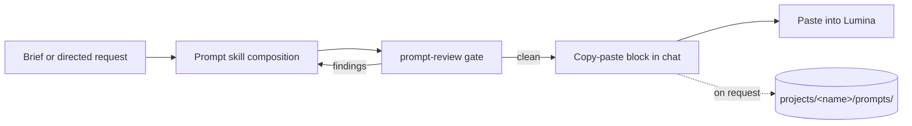

# seed-prompt-studio

> A prompt-only workspace for composing **Lumina-paste-ready prompts** for BytePlus / Volcano Engine Seed models — **Seedance** (video), **Seedream** (images), and **Seed Audio** (audio).

This repository ships agent skills, not generation tooling. You describe what you
want, the agent composes a production-grade prompt from the skill libraries, runs
it through `prompt-review`, and hands you a copy-paste block for the Lumina UI.
The agent never calls a generation API, uploads media, or writes production files.

## What this is / is not

| This repo **is** | This repo **is not** |
|---|---|
| Prompt composition skills for Seed-family models | A generation pipeline — no MCP server, no Ark CLI |
| A review gate (`prompt-review`) for every generation-bound prompt | A renderer — no HTML/CSS/SVG, no HyperFrames |
| Chat-first delivery of paste-ready prompt blocks | A 3D or assembly tool — no Blender, no FFmpeg |
| Optional local prompt drafts under `projects/` | A production canvas — no `showcase.json`, no task registry |

For the full generation pipeline, use the partner workspace
[`byteplus-sa/ark-director`](https://github.com/byteplus-sa/ark-director),
which pairs these same skills with the
[`byteplus-sa/ark-mcp`](https://github.com/byteplus-sa/ark-mcp) server.

## How it works



1. The agent routes your request to the relevant skill (grammar, presets,
   dialogue, acting, sheets, audio) and composes the prompt.
2. `prompt-review` checks the prompt against the workspace rule catalog before
   handoff; CRITICAL/MAJOR findings are fixed and re-reviewed.
3. You receive one copy-paste block — prompt text, ordered reference bindings,
   and the parameter block. Paste it into Lumina.
4. Drafts are saved locally only when you ask for them.

## Skills

| Skill | Summary |
| --- | --- |
| **brief-intake** | Shape intent-led briefs and treatments; preserve confirmed decisions. |
| **prompt-review** | Review and fix prompts written for BytePlus generative models (Seedance, Seed Audio, Seedream) against the repo's skill best practices using a sub-agent review pipeline. |
| **seedance-prompt-25** | Write production-grade Seedance 2.5 video prompts with the six-part formula, 50-material multimodal referencing, variable-duration staging (4-30s), timestamp pacing, structured editing, extension, keyframes, storyboards, and blockouts. |
| **seedance-prompt-25-filipino** | Write Filipino and Taglish dialogue direction while preserving exact words and register; evidence-based pronunciation hypotheses and opt-in lip-sync audio. |
| **seedance-prompt-20** | Legacy Seedance 2.0 prompt skill for 4K output (unsupported by 2.5), Fast/Mini speed variants, or lower cost per generation. |
| **seedance-acting-console** | Turn playable motives and tactics into observable acting cues appropriate to framing, visibility and intensity. |
| **seedance-animation-styles** | Write Seedance animation prompts for claymation, needle felt, wood puppets, toy miniatures, rubber hose, painterly 2D, cubist ink, stylized 3D, silicone creatures, and wax crayon. |
| **seedance-camera-presets** | Turn a named camera move (dolly, pan, orbit, crane, tracking, handheld, FPV, aerial, bullet time, dolly zoom, whip pan, one-take, static) into a drop-in Camera block. |
| **seedance-graybox-world** | Write Seedance prompts for the untextured gray graybox/blockout look when gray IS the desired final style, not just a previs reference. |
| **seedance-lens-presets** | Translate a lens, focal length, aperture, or sensor request into a canonical visible-result phrase for Seedance prompts or Seedream style. |
| **seedance-lighting-presets** | Translate a named lighting setup into a canonical Seedream `Lighting:` recipe and a matching Seedance visual-style lighting phrase. |
| **seedance-pacing-presets** | Turn a named pacing preset (speed ramp, slow motion, bullet time, montage, cut rhythm, impact moment) into a timestamped motion, cut, and pacing block. |
| **seedance-motion-design** | Write Seedance 2.5 motion-design prompts for marketing deliverables; exact typography and UI are out of scope in this workspace. |
| **seedance-music-video** | Develop track-informed music-video treatments with intentional escalation, restraint, repetition or counterpoint and optional evidence-based synchronization. |
| **seedance-restoration** | Write Seedance video-to-video restoration prompts that remove grain, noise, scratch lines, dust, and flicker from aged footage while preserving the shot. |
| **seedance-vfx-prompt** | Write structured video-to-video VFX prompts with the `@Video N` / `@Image N` reference grammar, VFX taxonomy, relighting, layered space, and timing triggers. |
| **seedream-prompt** | Write Seedream prompts for synthesized or edited imagery; exact typography, pricing, CTA, product grids, and logos are out of scope in this workspace. |
| **seedream-character-sheet** | Write structured Seedream prompts for three-panel character sheets and identity references — the face anchors Seedance uses. |
| **seedream-location-asset** | Write structured Seedream prompts for cinematic location assets and reusable environment sheets. |
| **seed-audio-prompt** | Write structured Seed Audio 1.0 prompts for full-soundscape audio generation including dialogue, music, SFX, and ambience. |
| **ugc-ad-modes** | Write hooks, scripts and Seedance prompts for nine ad modes using supplied product facts, audience objections, supported claims and accurate CTAs. |
| **ugc-motion-presets** | Turn a named UGC motion preset (Atomic, Outfit Switch, Eating Zoom, Yacht, ...) into a canonical Seedance prompt block with reference bindings, duration, and constraint flags. |
| **color-grade-palettes** | Map a named color grade palette or film look into a canonical grade sentence for the Seedance Visual Style slot or the Seedream `Style:` section. |
| **tig-blocking-map** | Give Seedance characters DISPOSITION via a color-coded outline schematic — a staging reference for multi-character blocking. |
| **tig-scene-engine** | Write and audit screenplay scenes using a five-element dramatic engine — Goal, Obstacle, Tactic, Reversal, Value Shift. |

## Contracts

| Need | Source |
| --- | --- |
| Prompt review policy and stable rule IDs | [`.agents/contracts/rules.json`](.agents/contracts/rules.json), [`.agents/contracts/production-policy.md`](.agents/contracts/production-policy.md) |
| Camera, lens, lighting, grade, acting, pacing, blocking, medium axes | [`.agents/contracts/seedance-reference.md`](.agents/contracts/seedance-reference.md) |
| Canon, props, screens and reference roles | [`.agents/contracts/element-identification.md`](.agents/contracts/element-identification.md) |
| Dialogue synchronization and assembly | [`.agents/contracts/audio-video-alignment.md`](.agents/contracts/audio-video-alignment.md) |

## Repository structure

```
seed-prompt-studio/
├── AGENTS.md                       # workspace contract for agents
├── .agents/
│   ├── contracts/                  # prompt-only policy, axes, descriptors, rule IDs
│   └── skills/                     # 25 prompt-composition skills
└── projects/                       # local drafts (save-on-request; never a default Git staging target)
    └── <project-name>/
        ├── project.md              # optional brief
        └── prompts/                # saved prompt snapshots
```

## Related repositories

- [`byteplus-sa/ark-director`](https://github.com/byteplus-sa/ark-director) — full production workspace: MCP + Ark CLI generation, deterministic HTML graphics, HyperFrames, Blender, assembly, and the production canvas.
- [`byteplus-sa/ark-mcp`](https://github.com/byteplus-sa/ark-mcp) — Model Context Protocol server for BytePlus ModelArk generation tools.
